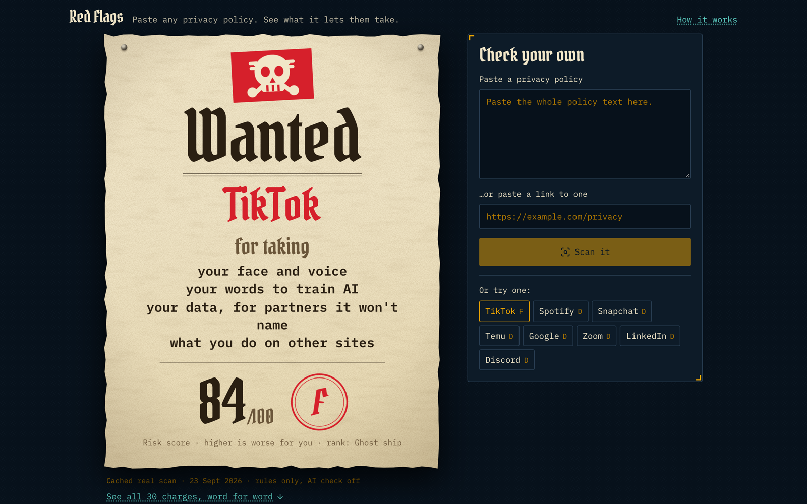

# Red Flags

Paste any privacy policy. See what it lets them take.



Red Flags reads a privacy policy and makes a WANTED poster for the company, listing what the policy lets it take. Every charge quotes the exact sentence from the policy, so you can check it yourself.

It also catches **weasel words**: phrases that sound harmless ("trusted partners", "improve our services", "affiliates") and what they actually allow.

Built for [Hackyard Yard #3](https://hackyard.tech/yards/yard-3), theme **One Screen**. The whole app lives on one page. No routes, no second page.

**Live:** https://redflags-yard.vercel.app

## Try it

1. Open the page. TikTok's poster is already there, from a real scan of its policy.
2. Pick one of eight real policies (TikTok, Temu, Snapchat, Spotify, Discord, Zoom, LinkedIn, Google), paste your own, or paste a link to one.
3. Open any charge to see the sentence it came from, highlighted in the full policy.

## How it works

1. **Split.** The policy is cut into sentences, and each keeps its exact position in the text.
2. **Rules.** Seventeen kinds of harm, each with its own patterns, run over every sentence. A filter drops sentences that deny the harm ("Mozilla does not track users…"), make it conditional on your consent, or describe a legal requirement.
3. **Weasel words.** Sixty-five phrases that sound harmless are matched and translated into what they permit.
4. **AI check.** If a Groq key is set, `gpt-oss-120b` looks for what the rules missed. Its findings go through the same gate as the rules: the quote has to be found word for word in the policy, and a denial or a consent-gated sentence is dropped. Without a key, the rules run on their own.
5. **Score.** Each kind of harm counts once at full weight; repeats add a little, up to double. The total becomes a score out of 100 and a letter grade.

## The guarantee

A charge appears only if its quote matches the policy character for character. Every quote carries its start and end position, and the tests check `text.slice(start, end) === quote` for every charge across all eight policies. The AI cannot invent a clause.

## How good is it

We measured the rules against 240 sentences from the eight policies (`eval/gold.json`). Separate AI reviewers labeled each sentence without seeing what the scanner said. A second AI then re-read a random 15 and disagreed with none. No human has labeled them, so treat these as a careful estimate rather than ground truth. Half the sample came from sentences an early version flagged, so it leans toward hard cases.

| | first version | now |
|---|---|---|
| precision | 31.7% | 54.3% |
| recall | 74.5% | 86.3% |

An independent re-run from scratch reproduced the first column and a mid-point of 53.7%; one more fix since took precision to 54.3%. The scanner still over-flags; it leans toward showing you a borderline sentence rather than hiding a real one. `eval/results.tsv` lists every change we tried, including the ones we threw away.

## Run it

Next.js 16, TypeScript, Tailwind CSS 4, Vercel AI SDK 7 with Groq, Vitest.

```bash
pnpm install
cp .env.example .env.local   # optional: add GROQ_API_KEY for the AI check
pnpm dev
pnpm test
```

The tests never call Groq.

## Hackathon note

The idea predates this week. The code does not: every file here was written between Sep 21 18:00 UTC and Sep 25 18:00 UTC 2026, per the Yard #3 rule *"The idea can be old. The code cannot."* Built with Claude (Claude Code); the commits say which model wrote what.

## License

MIT. Not legal advice: a policy says what a company reserves the right to do, not what it has done.
